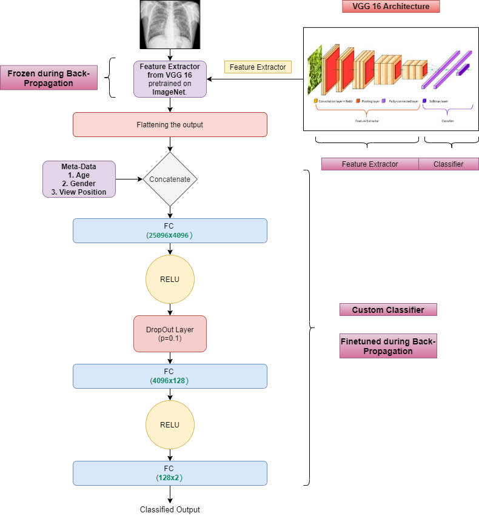

# COVID-19 detection using chest XRays

## Framework used

Pytorch

### 

## Data Preprocessing

* The original dataset has 930 images with around 66% of the images being covid positive.
* However, the dataset was not very clean and many fields were empty. 
* After cleaning up the data (detailed explanation is given in the comments of the code), I was left with 668 images which I split into a training set (90%) and validation/testing set (10%).

## Model Used

In order to account for meta-data such as age, gender, view position, I designed my own classifier.

Steps 

Feature extractor from VGG16 -> 
Flattened the output -> 
Concatenated with the meta-data -> 
Used custom classifier.

**A detailed explanation of model and results is given in "Report_Results.pdf"**

